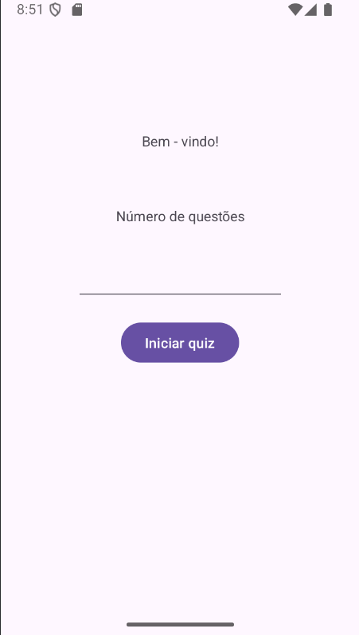
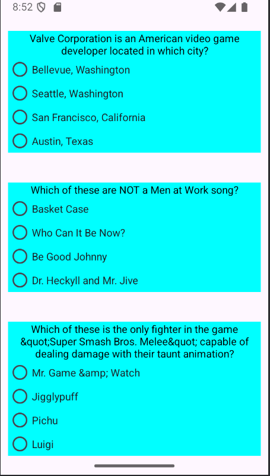
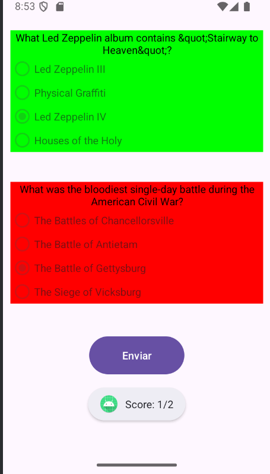

# 🧠 Quizzy

> Aplicativo Android para gerar quizzes usando a **Open Trivia Database**
# [Demonstração em vídeo 🎥](https://youtu.be/23ztjsdkKrg)

---
## 🎯 Sobre o Projeto

O **Quizzy** é um aplicativo Android que busca questões de quiz em uma API pública (Open Trivia DB) e as exibe para o usuário responder. Ele foi criado como forma de aprendizado e prática de integração com APIs, design de interface, uso de RecyclerView, entre outros conceitos de desenvolvimento Android.

### Funcionalidades

- Buscar questões através da API da Open Trivia Database.  
- Exibir listas de perguntas.  
- Permitir que o usuário selecione respostas.  
- Mostrar resultado/feedback ao final.  
- Manter estado da sessão (dependendo de como você queira evoluir).  

---

## 📷 Imagens

  

  

---

## 🧩 Arquitetura & Tecnologias utilizadas

- Linguagem: **Java**  
- Plataforma: **Android**  
- Componentes principais:
  - `RecyclerView` para exibir listas de perguntas  
  - `Adapter` + `ViewHolder` para gerenciar os itens da lista  
  - Requisições HTTP (okHttp, Retrofit ou outro) para comunicação com a API  
  - JSON para serialização / desserialização de dados  
  - Layouts XML para as interfaces  
